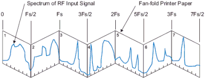
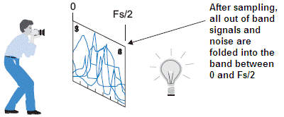
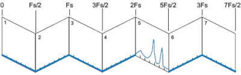
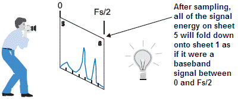

# frequency transposition

~ Investigate two potential ways to achieve a frequency transposition ~

This work was produced as part of an internship I did at Naval Group (used to be DCNS) in the south of France. Naval Group is a French industrial group specialized in naval-based defense and marine renewable energy.

I had to program a way for the engineers to hear ultrasound underwater frequencies during their testing operations. I compared the performance of two techniques to achieve a frequency transposition of a signal, a complex product (complex demodulation) and the undersampling property. I worked on Matlab and implemented the final solution in LabView. In the end, the complex product was used, but it requires some costly hardware with high sampling rate capability.

## Complex Product

For a high-frequency signal of min frequency f1, simply take the product of your original signal with a cosine of frequency f1-f2, where f2 is your target min frequency. This will also duplicate the original signal at frequency f1+f2, but this band can be removed by filtering the final signal. Frequency transposition using a complex product works both with discrete and continuous signals.

## The Undersampling Property

The Nyquist-Shannon criterion tells us that the sampling frequency of a continuous-time signal should be at least twice as much as the maximum frequency of the signal. This is fine if we need to sample a baseband signal. But if the signal we want to sample is at a high frequency like 100MHz, with a 20KHz bandwidth, this would require a sampling rate of at least 200 Mhz, which is impossible to achieve without some expensive hardware equipment. To work around this issue, we can use a property of the Discrete Fourier Transform: when we take the Fourier transform of a discrete signal, like a continuous signal sampled at frequency fs, we observe that the spectrum of the original signal will repeat itself every (2 x k x fs) Hz. 

  

By sampling the original signal at a rate of exactly twice that of the bandwidth and then taking its Fourier transform, the spectrum of the original signal will **fold** itself from 0Hz to fs/2 Hz. While this is detrimental when sampling a baseband signal (a phenomenon known as [aliasing](https://en.wikipedia.org/wiki/Aliasing)), it can be exploited to **move** down a high-frequency signal back to baseband.

  

  

Because the spectrum folds itself every fs/2, we must make sure to filter everything that is out of the band of interest. Otherwise, we will add a lot of noise and undesired things to the transposed signal.

  

  

## Comparisons

Undersampling has several advantages compare to oversampling with a complex product. When undersampling, the data rate is much lower, which requires fewer data storage and processing. A lower sampling rate also requires less power from the ADC (Analog/Digital converter). However, undersampling can be challenging. Designing narrow filters around the bandpass signal can be a difficult endeavor.

## Source

Image taken from this article => https://www.eetimes.com/how-to-use-undersampling/#